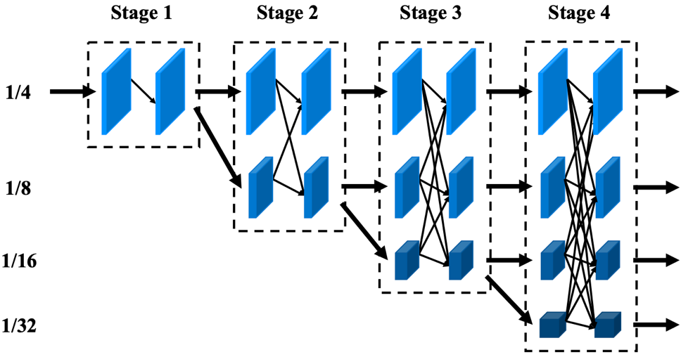
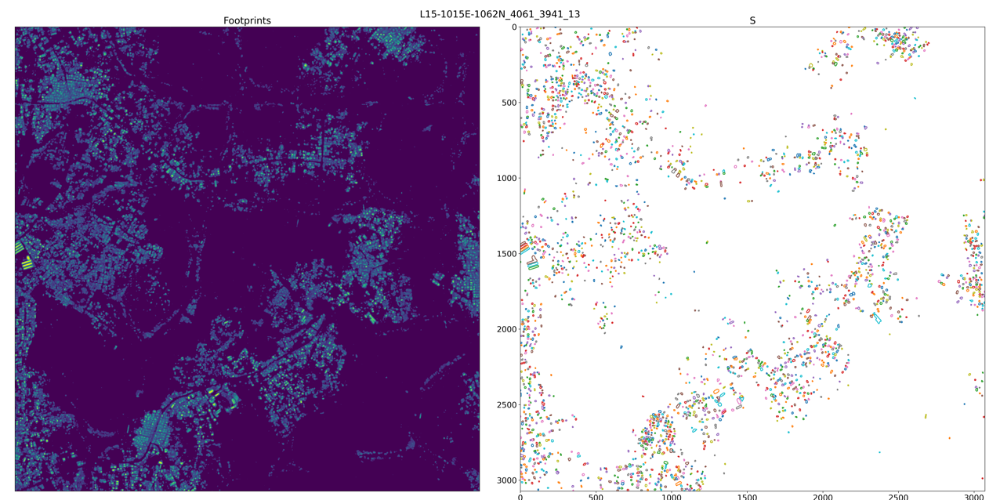
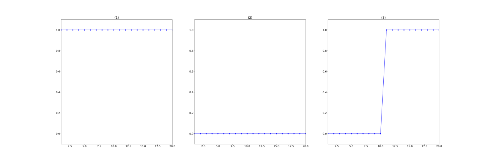
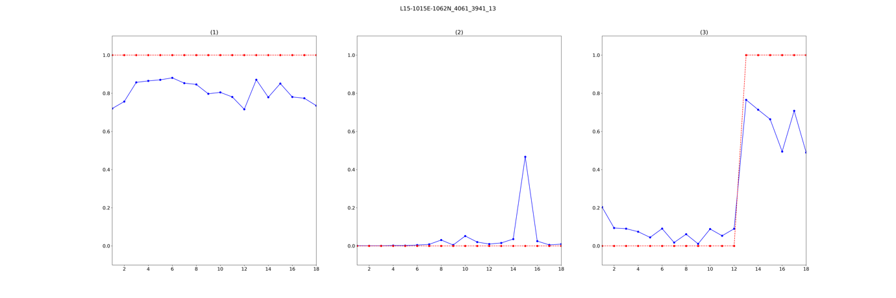

## Marathon Match - Solution Description

### Overview
Congrats on winning this marathon match. As part of your final submission and in order to receive payment for this marathon match, please complete the following document.

#### 1. Introduction
Tell us a bit about yourself, and why you have decided to participate in the contest.
-  Name: Xiang Long, Honghui Zheng, Yan Peng, Shumin Han
-  Handle: lxastro0
-	Placement you achieved in the MM:
-	About you: Xiang Long is currently a senior research and development engineer at the Department of Computer Vision (VIS) Technology, Baidu Inc. Honghui Zheng and Yan Peng are senior software engineers at the VIS, Baidu Inc. 
-	Why you participated in the MM: We are just in the process of developing a change detection solution for time series remote sensing image sequences. Multi-Temporal Urban Development Challenge is a very suitable scenario to help us develop and exam new solutions.

#### 2. Solution Development 
How did you solve the problem? What approaches did you try and what choices did you make, and why? Also, what alternative approaches did you consider?

- First, we use the semantic segmentation scheme. 

There are actually some other candidates: object detection and instance segmentation. But considering that there is no intersection between buildings, and there are too many buildings in one image, instance segmentation requires more inference time. We believe that in this scenario, semantic segmentation will be more appropriate than instance segmentation. Object detection is another candidate solution. Since the IoU threshold (0.25) is not harsh, if we can detect each building correctly, we can already get a good result. However, considering that the number of targets in each image is particularly large and the targets are extremally small, a special detection method needs to be designed. Considering the limitation of time during challenge, we did not try this solution.

- Second, we use HRNet as our segmentation model. 

On the one hand, HRNet can obtain state-of-the-arts results on many other datasets, such as cityscapes. On the other hand, many buildings are very small and require higher resolution. HRNet always maintains a high-resolution branch, which is more suitable in this scenario. In addition, we did not try any customization of HRNet, mainly because each customization needs to be pre-trained on ImageNet again, which takes too much time. We directly used the HRNet model preset in PaddleSeg and the corresponding ImageNet pre-training weights.

- Third, we upsample the image to 3x size for training and inference.

The main consideration is that even if HRNet is used, there will be a 1/4 downsampling at the beginning of the network. This is unacceptable for buildings with the smallest size of 2x2 pixels. We tried upsampling 2x and 3x, and find 3x is better. 

- Finally, we find that the quality of the post-processing method is crucial. 

We first used the baseline post-processing method, and then focused on optimizing the segmentation model. As a result, we found that the quality of the model does not seem to be related to the final SCOT score. Thus, we decided to design a new post-processing method. This is also the core innovation part of our solution, which will be described in detail later.

#### 3. Final Approach
Please provide a bulleted description of your final approach. What ideas/decisions/features have been found to be the most important for your solution performance:

- Data preprocessing

We divide the provided training data into a training set and a validation set. The provided training data contains 60 AOIs, and we select 10 AOIs as our validation set. For the convenience of reproducibility, Table 1 lists the 10 AOIs that we use as the validation set:

| AOIs in validation set ||
| :------: | :------: |
| L15-0387E-1276N_1549_3087_13 | L15-1276E-1107N_5105_3761_13 |
| L15-0566E-1185N_2265_3451_13 | L15-1438E-1134N_5753_3655_13 |
| L15-0632E-0892N_2528_4620_13 | L15-1615E-1206N_6460_3366_13 |
| L15-1015E-1062N_4061_3941_13 | L15-1690E-1211N_6763_3346_13 |
| L15-1200E-0847N_4802_4803_13 | L15-1848E-0793N_7394_5018_13 |
Table 1. AOIs in validation set.

All the training and inference are performed under 3x conditions. For the .tif image, we zoomed in by 3 times, and we multiplied by 3 for the coordinates of all buildings. Other preprocessing is completely consistent with the provided baseline code. In order to speed up the reading of the training data, for the training set, we pre-cut the images and masks into 512x512 patches.

- Model training and inference

We use HRNet [1] as our semantic segmentation model. The network structure of HRNet is shown in the Figure 1. The difference between HRNet and other networks is that it always maintains a high-resolution branch. This is why we choose it as our backbone.
 

Figure 1. Architecture of HRNet.

We use the HNet-W48 based on PaddleSeg [2] and its ImageNet pretrain weights. We set the number of classes of the last convolutional layer to 2, corresponding to buildings and others.

During training, we use 512x512 input. The batch size is set to 16. We use SGD optimizer, with initial learning setting to 0.01, and divided by 10 at 40 and 60 epochs. Total of 70 epochs are trained. We test on the validation set after each epoch and choose the model with the largest IoU for the building class as the final model.

During inference, we also cut the input image into a non-overlapping 512x512 patches and input them to the network. Then, we fetch the probability of the building class after the softmax layer, and then spliced it into the original image size as the output. Note that the inference here is also performed at 3x, and the output probability map is also at 3x scale. The probability map will be the input of the post-processing module.

We only train a single model, and do not perform multi-model ensemble, mainly because we want the overall pipeline to be more concise and practical. In fact, our training and inference time is still rich enough to use more models, so ensemble may bring more performance improvement.


- Post-processing based on temporal and spatial collapse

First, we analyzed the SCOT score obtained by using the baseline post-processing method for different models. The results are shown in Table 2, and the visualized results of each model prediction are shown in Figure 2 and Figure 3. The visualization results show that HRNet is better at finding buildings with lower confidence, but its SCOT score is lower. HRNet 3x is better than 1x, but the SCOT on val is almost the same. We think this is likely to be caused by post-processing methods, so we designed a new post-processing method based on the characteristics of this task.

| Model	| post-processing |	SCOT val (%) | SCOT test (%) |
| :------: | :------: | :------: | :------: |
| UNet (baseline) | baseline | - | 15.8 |
| HRNet 1x | baseline | 12.3 | 13.9 |
| HRNet 3x | baseline | 12.8 | - |
Table 2. SCOT scores for different models using baseline post-processing.


Figure 2. Visualization of different models.


Figure 3. Visualization of different models (zoomed in).

First, for simplicity, we made the following assumptions:

(a) The building will not change after the first observation. That is, a building will not be remodeled, and its boundary coordinates will not change in any way.

(b) In the 3x scale, there is at least one-pixel gap between two different buildings.

Based on observations on the training data, these two assumptions are basically satisfied in this task.

We consider a single AOI, the image sequence can be considered as a video with a length of N frames. We denote the probability map output by the model of the t-th frame as $P^t$, and the probability that the position of the $i$-th row and $j$-th column being a building is $P_{ij}^t$. For the sake of simplicity, we do not consider the case of cloud cover here. In actual processing, the area occluded by the cloud can be simply ignored, and no buildings are output in this area.

According to Assumption (a), the boundary coordinates of each building are the same at any time. So we can compress the temporal dimension and predict the spatial location of each building only once. Considering an ideal situation, the prediction accuracy of the segmentation model is 100%. The predict masks are exactly the same as the ground truth labels. The probability value corresponding to all positions is 0 or 1. We can compress the temporal-spatial probability tensor $P$ into the spatial probability matrix $S$ as following:

$S_{ij}=\frac{\sum_{t}P^t_{ij}\mathbb{I}(P^t_{ij}\ne0)}{max(\sum_{t}\mathbb{I}(P^t_{ij}\ne 0), \varepsilon)}$

where $\varepsilon$ is a small number such as 1e-8. We called this process as temporal collapse.

Figure 4 shows an example of temporal collapse. The left one is the compressed spatial probability map, and others are sampled frames. It can be seen that the function of temporal collapse is to compress all the buildings that have existed for at least one frame in the observation period onto the same probability map.


Figure 4. Visualization of temporal collapse for ground truth masks (zoomed in).

For the real situation, the probability cannot be exactly 0 or 1, so we use a threshold to get an estimated spatial probability matrix $S$:

$S_{ij}= \frac {\sum_{t} P^t_{ij}\mathbb{I}(P^t_{ij} \geq \alpha)}{max(\sum_{t}\mathbb{I}(P^t_{ij} \geq \alpha),\varepsilon)}$

Figure 5 is an example of temporal collapse for model prediction masks. The left one is the compressed spatial probability map, and the others sampled frames. In fact, this method also plays a role of ensemble in temporal sequence, which can get more accurate spatial coordinates of building boundary.


Figure 5. Visualization of temporal collapse for model prediction (zoomed in).

According to Assumption (b), we can calculate the connected components on the compressed spatial probability matrix S to determine the spatial position of all buildings. However, considering that the difficulty of distinguishing buildings is different, for example, large factories generally have high confidence, while small houses generally have low confidence. Therefore, it is not appropriate to directly apply a fixed threshold to calculate the connected components.

Ideally, the probability value of a building area should be at least a local maximum. Therefore, we use an improved version of the watershed algorithm to get the boundary of each building. The algorithm steps are as follows:

1) We find all the local maxima in the area of $S_{ij}>β_{l}$, take an all-zero matrix with the same size as S, and set the local maxima positions to 1. We denote it as $M_{1}$.
2) For $M_{1}$, we set all positions of $S_{ij}>β_{h}$ to 1, and denote it as $M_{2}$.
3) Taking $M_{2}$ as the seed, within the region satisfied $M_{1}=1$, we use the watershed algorithm to achieve boundaries according to $-S$.

Thresholds $β_{l}$ and $β_{h}$ are two hyperparameters. Figure 6 shows the visualization result of the boundaries we got, in which the left one is $S_{ij}$, and the right one is the obtained boundaries. We call the boundaries obtained here as building candidates. We denote the points inside the boundary of the l-th building as $G_{l}$.


 Figure 6. Visualization of temporal collapse for model prediction (zoomed in).

After determining the spatial location of the building, we also need to determine the “location” of the building along the temporal dimension. To simplify, we further make the following assumption:

(c) Each building will not be demolished during the whole observation period.

This assumption is not necessarily satisfied, but considering that most of the changes in this challenge are new construction of buildings, we do not consider demolition here for simplicity.

Since we have already determined the spatial location of the building candidates. For each building candidate, we can apply spatial collapse, which is to average all the probability values inside the building boundary for each frame:

$T_{l}^t= \frac{1}{|\{ (i,j) \in \mathcal{G}_{l} \}|} \sum_{(i,j) \in \mathcal{G}_{l}} P^t_{ij}$

According to Assumption (c), we can conclude that there are only three situations for a single building candidate:
1) always exist in all frames
2) never exist in any frames
3) not exist at the first k frames and exists at the last N-k frames ($1 \le k < N$)
Three different situations is shown Figure 7:


Figure 7. Different situations after spatial collapse for a single building.

Since $T_{l}^t$ cannot be completely accurate, we use the following approximation method to determine the estimated final states of the building in each frame:

1) Calculate the average probability of $T_{l}^t$ from left and right:
   
   $\overleftarrow{T}^t_{l}=\frac{1}{t}\sum_{k=1}^tT_{l}^k$, $\overrightarrow{T}^t_{l}=\frac{1}{N-t+1}\sum_{k=t}^N T_{l}^k$

2) If $max( \overrightarrow{T}^{t+1}_{l} -  \overleftarrow{T}^t_{l} ) < \gamma_{d}$, then we believe that the state of the building has not changed during the observation period. We determine the final states as following:
   
   $\widetilde{T}_{l}^t=\begin{cases}1, \frac {1}{N} \sum_{t} T^t_{l} \geq \gamma_{m}\\0,\frac {1}{N} \sum_{t} T^t_{l} < \gamma_{m}\end{cases}$

3) If $max( \overrightarrow{T}^{t+1}_{l} -  \overleftarrow{T}^t_{l} ) \geq \gamma_{d}$, then we believe that the state of the building has changed during the observation period. We estimate the change point $\tau_{l}=inf\{t| T_{l}^t > \gamma_{s} \cdot max_{k} T_{l}^k   \}$, and the final states:
   
   $\widetilde{T}_{l}^t=\begin{cases}1,t \geq \tau_{l}\\0,t < \tau_{l}\end{cases}$
   
Thresholds $γ_{d}$ and $γ_{s}$ are hyperparameters. Figure 8 shows examples of these three cases.


Figure 8. Temporal probabilities $T_{l}^t$ (blue) and final estimated $\widetilde{T}_{l}^t$ (red).

In summary, through temporal collapse, we determine the spatial location of the building; through spatial collapse, we determine the existence of the building in each frame. Combine them together and we can get the final prediction result. We denote this method as STC-1.

In addition, in order to further improve the performance, we found that the tracking score and change detection score will be optimal under different hyperparameters, so we adopted two sets of hyperparameters. We first use one set of hyperparameters for post-processing, and only retain the results of the changed buildings. Next, we fill in the changed building area in S as 0. And then use another set of hyperparameters to get of the results of buildings that have always existed or not. We denote this method as STC-2. The post-processing methods are compared in Table 3.

| Model	| post-processing |	SCOT val (%) | SCOT test (%) |
| :------: | :------: | :------: | :------: |
| HRNet 3x | baseline | 12.8 | 13.90 |
| HRNet 3x | STC-1 | 37.2 | 38.89 |
| HRNet 3x | STC-2 | 37.6 | 39.32 |
Table 3. SCOT scores for different post-processing methods using same model.

<font size=1>[1] J. Wang, K. Sun, T. Cheng, B. Jiang, C. Deng, Y. Zhao, D. Liu, Y. Mu, M. Tan, X. Wang, W. Liu, and B. Xiao. Deep high-resolution representation learning for visual recognition. IEEE Transactions on Pattern Analysis and Machine Intelligence, pages 1–1, 2020.</font>
<font size=1>

[2] https://github.com/PaddlePaddle/PaddleSeg</font>

#### 4. Open Source Resources, Frameworks and Libraries
Please specify the name of the open source resource along with a URL to where it’s housed and it’s license type:

- PaddleSeg, https://github.com/PaddlePaddle/PaddleSeg, Apache License 2.0

#### 5. Potential Algorithm Improvements
Please specify any potential improvements that can be made to the algorithm:

- Model ensemble: Now, only a single model is used, and the training set is not fully utilized. If we use multi-models for ensemble, better performance can be achieved.

- Post-processing hyper-parameter search: Now the hyper-parameters are manually set by experience, and a hyper-parameter search may get better results.

- Use sequence model such as RNN or LSTM to train a post-processing module separately. In the case of sufficient data, it is generally better than post-processing with custom rules.

#### 6. Algorithm Limitations
Please specify any potential limitations with the algorithm:

- The hyperparameters of current post-processing algorithms depends on the degree of convergence of the model. For a new model, it may be necessary to re-determine the hyperparameters of post-processing to get the good results.

- The current post-processing algorithm run slower for poorly trained models, because too many invalid building candidates will be generated, which increases the computational complexity.

- The current algorithm is only effective for classes that do not change much, such as buildings, and is not applicable to classes that frequently change.

#### 7. Deployment Guide
Please provide the exact steps required to build and deploy the code:
- Build docker image:
```
docker build -t <id> .
```
- Run docker:
```
docker run -v <local_data_path>:/data:ro -v <local_writable_area_path>:/wdata -it <id>
```
Please see https://github.com/topcoderinc/marathon-docker-template/tree/master/data-plus-code-style

#### 8. Final Verification
Please provide instructions that explain how to train the algorithm and have it execute against sample data:
- Train:
```
./train.sh /data/train
```
- Test: 
```
./test.sh /data/test/ solution.csv
```

#### 9. Feedback
Please provide feedback on the following - what worked, and what could have been done better or differently?
- Problem Statement - None
- Data - None
- Contest - The competition process is not very friendly to the team that uses TopCoder for the first time, including how to form a team, how to declare additional data, and how to submit the code. It is suggested that these contents should be explained more detailed at more obvious position.
- Scoring - None

